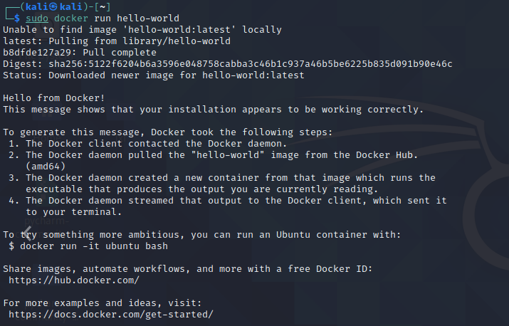
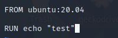
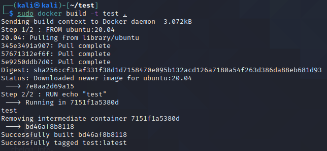
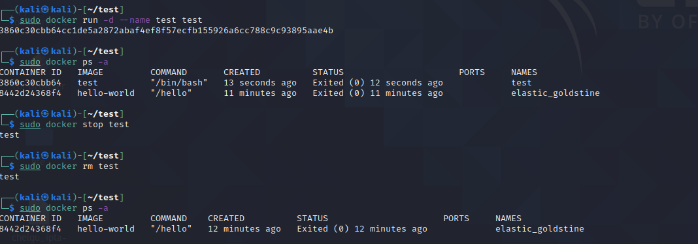

Вопросы:
1. что такое образ docker, какими способами можно получить в системе образы докер?
 Docker-образ — шаблон для создания Docker-контейнеров. Представляет собой исполняемый пакет, содержащий все необходимое для запуска приложения: код, среду выполнения, библиотеки, переменные окружения и файлы конфигурации. Можно получить из архива образов (Docker Hub или др.) или создав его с помощью docker build
2. что такое слой докер образа?
 Слой представляет собой инструкцию или изменение файловой системы образа
3. как посмотреть список образов, удалить? посмотреть все слои в образе?  
 docker images  
 docker image rm image_name  
 docker history image_name  
4. напишите команду запуска docker контейнера  
 docker run [options] image_name [command] [args]  
5. напишите команду входа внутрь docker контейнера  
 docker exec [options] image_name [command] [args]  
6. какие режимы работы сетей есть в docker? опишите как они работают?
 - bridge - режим моста, сетевой стек изолируется, автоматически настраиваются правила передачи пакетов и эмулируется L2 мост
 - host - сетевой стек контейнера не изолируется от хоста и разделяет пространство имен хостовой сети
 - overlay - распределенная сеть между несколькими контейнерами
 - macvlan - эмуляция сетевого устройства, позволяет контейнеру получить MAC адрес и работать с физической сетью
 - none - отсутствие сети
7. что такое docker-compose? как применяется?
 - Docker-compose - инструмент создания и запуска многоконтейнерных Docker приложений.
 - Представляет собой объединение нескольких образов docker с настроенным сетевым стеком и окружением
 - Предоставляет команды для управления жизненным циклом всех сервисов внутри приложения

Праткика
1. запуск любого контейнера с docker-hub

2. создание своего собственного docker image (например nginx или любого другого)

3. запуск контейнера, остановка, удаление

4. написание микросервиса в docker-compose с сетями bridge и macvlan
