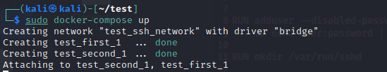

- сделать image контейнера с необходимым ПО для запуска sshd

- запустить docker-compose поднять два ssh сервера  
  docker-compose build  
  
  
- продемонстрировать что из одного контейнера можно войти в другой  

 по паролю  

  

 по ключу  

- выполнить команду

- передать файл

- продемонстрировать простейший обмен данными с помощью утилиты netcat

