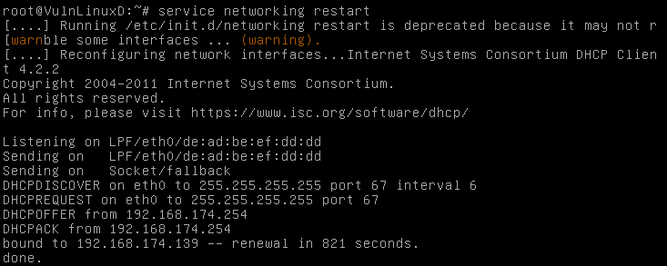

1. Каким уровнем называется физический уровень и что в него входит
 - Первый уровень модели OSI, в который входит физическая среда для передачи данных, нпример провода, радиоволны и тп.
2. Управление потоками данных происходит на
 - Транспортном уровне
3. Какие протоколы работают на третьем уровне?  и для чего используются?
 - IPv4, IPv6 - объединяют фрагменты сети в одну
 - ICMP - передает сообщения об ошибках
 - IPSec - набор протоколов для защиты данных
4. Какой протокол обеспечивает функцию фрагментации пакетов и что это такое ?
 - Протокол IP обеспечивает разбиение сетевых пакетов на меньшие для передачи между сетями с различными MTU(Maximum transmission unit)
5. Поле "Смещение флагов" в заголовке пакета IP содержит ?
 - Смещение передаваемых данных относительно начала данных в фрагментированном пакете 
6. Напишите пример подсети которая относится к классу C:
 - 200.0.0.0/24
7. Напишите пример фейковой подсети класса А.
 - 10.0.0.0/8
8. Какой командой добавить к текущему IP-адресу на интерфейсе eth0 адрес 10.15.35.1?
 - ifconfig eth0 add 10.15.35.1
9. Напишите команду добавления маршрута к сети через шлюз 192.168.2.1 10.15.35.0/255.255.255.0?
 - route add 10.15.35.0 netmask 255.255.255.0 gw 192.168.2.1
10. Какие вы знаете протоколы верхних уровней на базе UDP и их назначение?
 - SMB (Server Message Block) – протокол уровня приложений для передачи файлов.
 - DNS (Domain Name Service) – протокол уровня приложений для преобразовывания символьных имен в IP-адреса.
 - SNMP (Simple Network Managment Protocol) – протокол уровня приложений для сбора информации о состоянии сетевых устройств и управления ими.
11. Какой порт использует DNS для пересылки информации между зонами?
 - 53/TCP
12. Поле "сдвиг данных" в заголовке протокола TCP содержит
 - 32битные поля, содержащие длину заголовка
13. Первым пакетом в последовательности установки соединения в протоколе TCP передается пакет с установленными флагами
 - SYN
14. Технология установки соединения в протоколе TCP называется
 - Three-way handshake
15. Примеры сервисрв, использующие протокол TCP в качестве транспортного:
 - SSH, FTP, HTTP и прочие
16. Опишите принцип работы traceroute
 - Отправляются пакеты с постепенно увеличивающимся TTL. С TTL=1 первый же маршрутизатор вернет ошибку о нулевом TTL. С TTL=2 ответит второй маршрутизатор на пути пакета. И так далее, пока не будут пройдены все роутеры на пути.
17. Какой тип icmp запросов используется в ping утилите
 - Type 0 — Echo Reply
 - Type 8 — Echo

Практика
1. Произвести настройку IP адреса сетевого интерфейса eth0 через конфиг и на лету
 - Через конфиг:

    
  systemctl restart networking
 - На лету:  
  ifconfig eth0 192.168.0.2

2. Остановить и запустить сетевой интерфейс eth0  
  ifconfig eth0 down  
  ifconfig eth0 up  
3. Произвести смену аппаратного (MAC) адреса сетевого интерфейса eth0;

 

4. Показать таблицу сетевых маршрутов. Установить маршрут по умолчанию;

 

5. Получить настройки IP от DHCP сервера;

 

 

6. проверить пропускную способность между виртуальными машинами

 

7. настроить связь между виртуальными машинами через vlan 15

 

 

 
