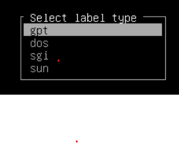
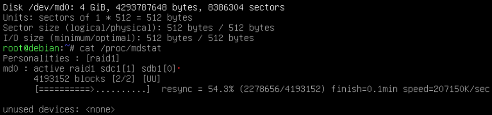
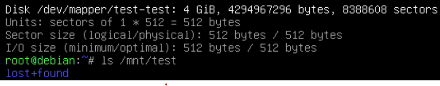
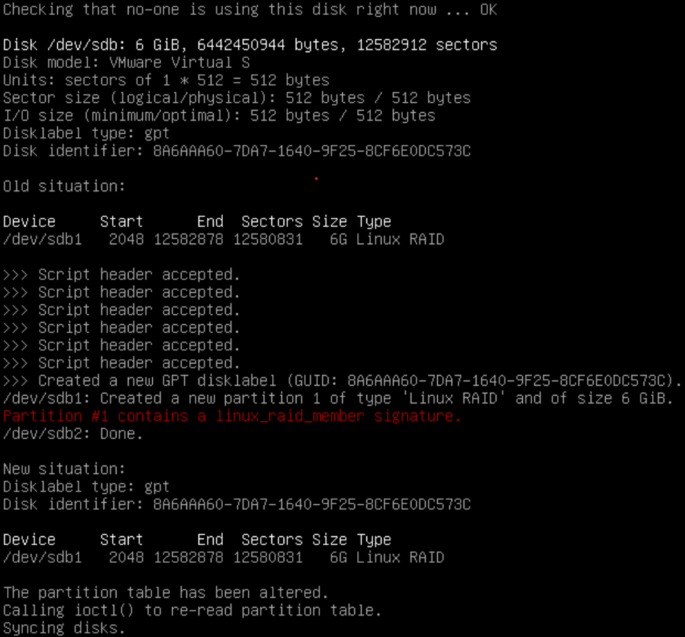
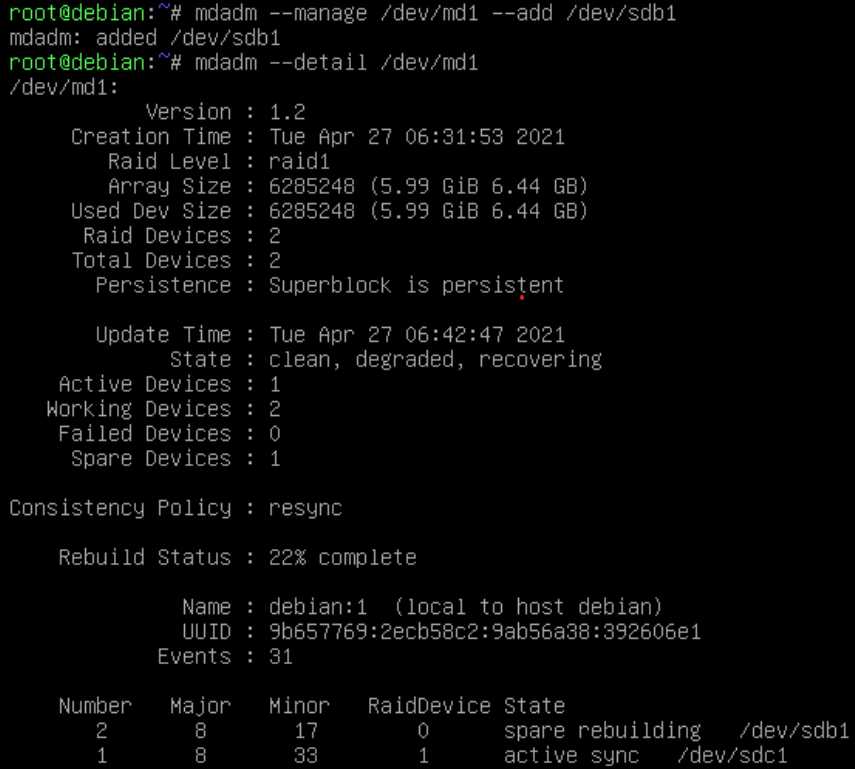
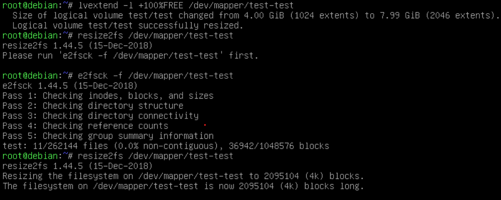
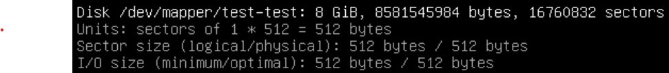

1. какие базовые цепочки и таблицы существуют в iptables и для чего служат?
 - Цепочки:
   - PREROUTING — пакеты до маршрутизации
   - INPUT — пакеты, для текущего хоста
   - FORWARD — транзитные пакеты
   - OUTPUT — пакеты от текущего хоста
   - POSTROUTING — все исходящие пакеты 
 - Таблицы:
   - MANGLE — классификация и маркировка пакетов и соединений, модификация заголовков
   - NAT — преобразование сетевых адресов и портов
   - FILTER — фильтрация трафика
   - SECURITY — изменение маркировок безопасности
   - RAW — действия с пакетами до обработки conntrack
   - RAWPOST — подмена исходного трафика без использования информации о соединении
2. опишите процесс обработки пакета который предназначен данной системе
 - PREROUTING -> INPUT -> LOCAL PROCESS -> OUTPUT -> POSTROUTING
3. что такое conntrack и для чего используется?
 - Отслеживает все логические сетевые соединения, чтобы идентифицировать пакеты из одного потока для дальнейшего использования их вместе
4. какими командами создать/удалить цепочку? создать/удалить правило? создать правило до определенного правила в цепочке?
 - Создать цепочку: iptables -N NEWCHAIN
 - Удалить цепочку: iptables -X NEWCHAIN
 - Создать правило: iptables -A NEWCHAIN [arguments]
 -  До определенного(N): iptables -I NEWCHAIN [N] [arguments]
 - Удалить правило: iptables -D NEWCHAIN

Практика:
1. Добавить в виртуальном сервере два hdd

2. Собрать на них raid1 массив  

 cfdisk /dev/sdb  
 cfdisk /dev/sdc  

  

 mdadm --create /dev/md0 --level=1 --raid-devices=2 /dev/sdb1 /dev/sdc1  

3. поверх raid массива развернуть lvm  

 pvcreate /dev/md1  
 vgcreate test /dev/md1  
 lvcreate -n test -L4G test  

4. создать файловую систему в lvm разделах и примонтировать в систему  
 mkfs.ext4 -L test /dev/test/test  
 mkdir /mnt/test  
 mount /dev/test/test /mnt/test  

5. продемонстрировать умение замены жесткого диска  
 mdadm --manage /dev/md1 --fail /dev/sdb1  
 mdadm --manage /dev/md1 --remove /dev/sdb1  
 sfdisk -d /dev/sdc | sfdisk /dev/sdb  

 mdadm --manage /dev/md1 --add /dev/sdb1  
 mdadm --detail /dev/md1  

6. расширить размер раздела за счет неиспользуемого пространтсва в raid массиве  
 pvresize /dev/md1  
 lvextend -l +100%FREE /dev/mapper/test-test  
 e2fsck -f /dev/mapper/test-test  
 resize2fs /dev/mapper/test-test  

